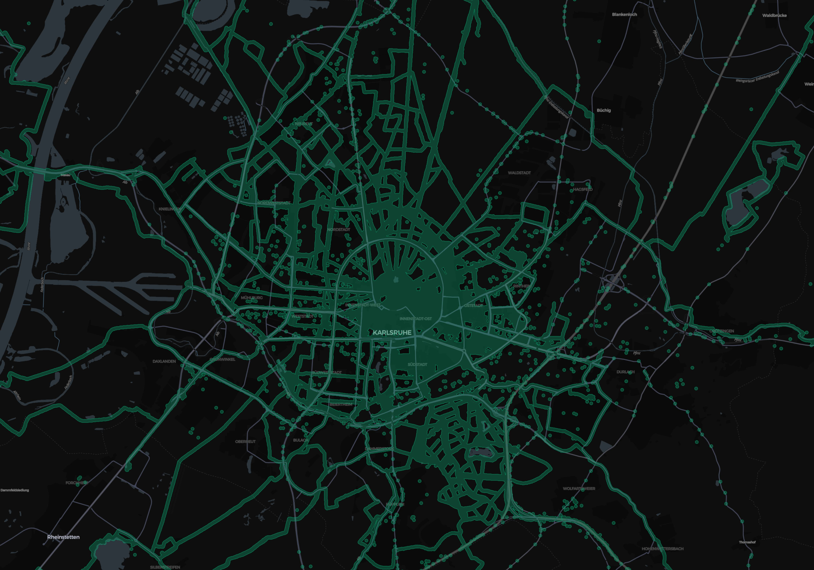

# fog of war

Convert data from different sources to a fog of war-style map. It generates three layers:

- **Points**: all points from your sources, rounded to 10m and deduplicated.
- **50m radius circles**: draws a circle with 50m radius around all points and dissolves them. Holes with a surface smaller than a circle with 50m radius are removed.
- **500m radius circles**: same as the 50m circles.

## Data

Currently supported:

- Strava (.gpx, .gpx.gz, .fit.gz)
- Google Timeline (`location-history.json`)

## Usage

First, prepare the data:

1. Collect all data and put it in the `data` directory.
2. Install [tippecanoe](https://github.com/felt/tippecanoe) (e.g. `brew install tippecanoe`).
3. Clone the repo.
4. Run `cargo run -r`.

Second, render the data. Inside the `ui` directory, do:

1. `bun install`
2. `bun run dev`

You should now be able to see an interactive map on `http://localhost:5173`.
